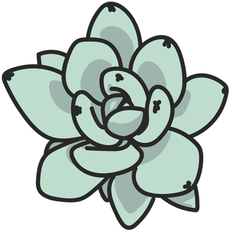

# web-integrador
Pagina desarrollada a modo prueba 
by Sebastián Lautaro Galbán

## Diseño UX

### 1- Objetivo Principal de la pagina y publico objetivo
La pagina va a estar orientada en información general de las plantas tipo suculentas, talleres intructivos para cuidados basicos y la adquisición de algunas de estas para el hogar.

### 2- Ideas del Cliente y Contenido

1. Presentación: Imagen de la empresa/logo/frase/Nombre/mision
2. Biblioteca digital: libros, documentos, noticias y cualquier informacion util para el cliente disponible gratuita o paga.
3. Productos: plantas a la venta
4. Servicios: talleres disponibles, servicios de cuidados a domicilio, visitas guiadas
5. Contacto: Redes sociales/mail/telefono/ubicación y formulario de contacto
 

### 3- Presentación de las ideas

1. Presentación: Imagen principal - Pantalla completa - 
2. Biblioteca Digital: diseño en tarjetas.
3. Productos: diseño en tarjetas 
4. servicios: pantalla dividida servicios de cuidados y talleres - Diseño en tarjetas 
5. Contacto: iconos de las redes sociales - formulario para el envio de correos a través de la pagina - mapa con la ubicación.

### 4- Wireframe

Pagina1: Pagina Principal (correjido)

Pagina2: Sección 1

## Diseño UI

### 1- Fonts

https://fonts.google.com/share?selection.family=Comic+Neue:ital,wght@0,300;0,400;0,700;1,300;1,400;1,700

### 2- Color tables

1. AEDE94
2. 7DB95C
3. 549431
4. 336F13
5. 1A4A00

### 3- Imagenes

1. Imagen1: Logo

2. Imagen2: Fondo 1 Pag. Princ.

3. Imagen3: Fondo 2 Pag. Princ.

